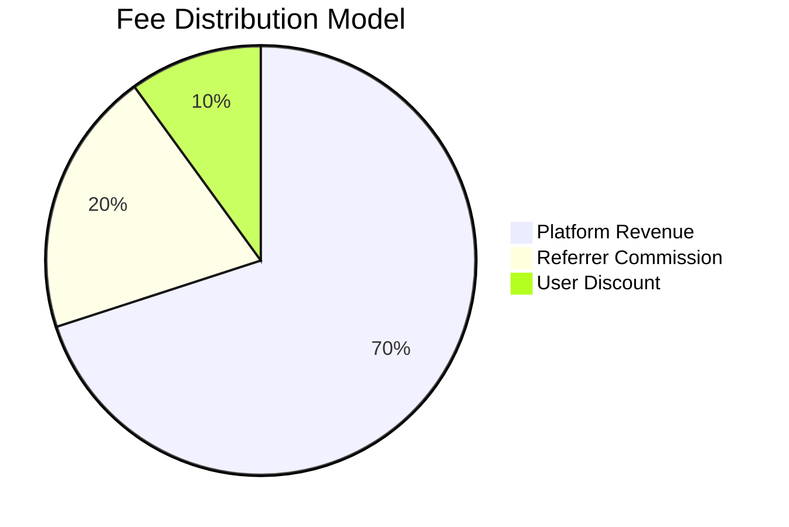
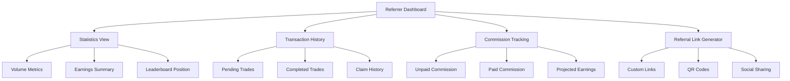
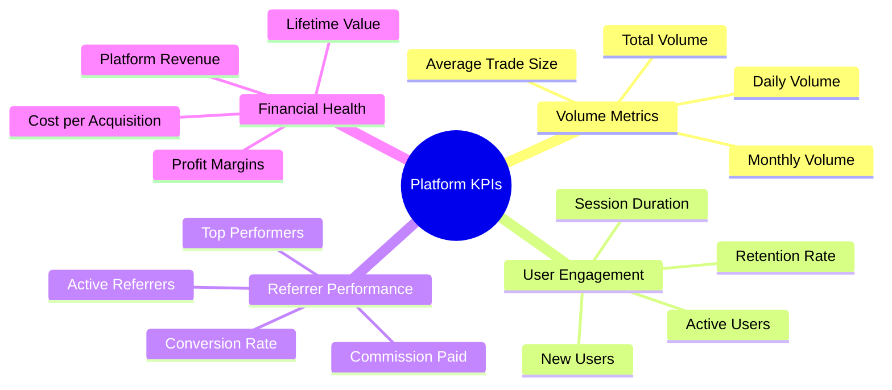
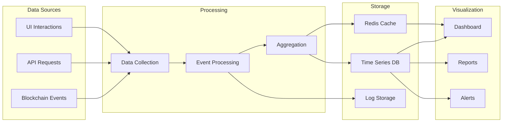
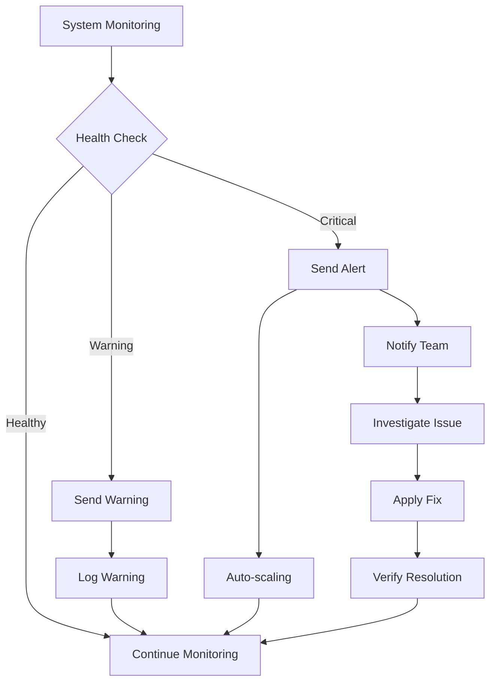
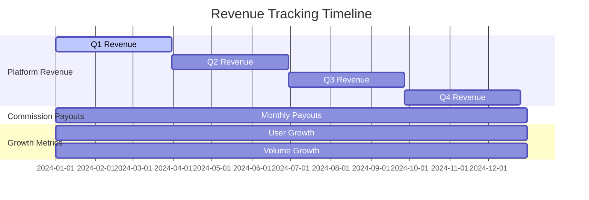

# Analytics & Monitoring

This document details the analytics and monitoring capabilities of the Jupiter Ultra Enhanced Referral System.

## Fee Distribution Breakdown

## Referrer Dashboard Features

## Key Performance Indicators

## Analytics Data Flow

## Monitoring Alerts

## Revenue Tracking

