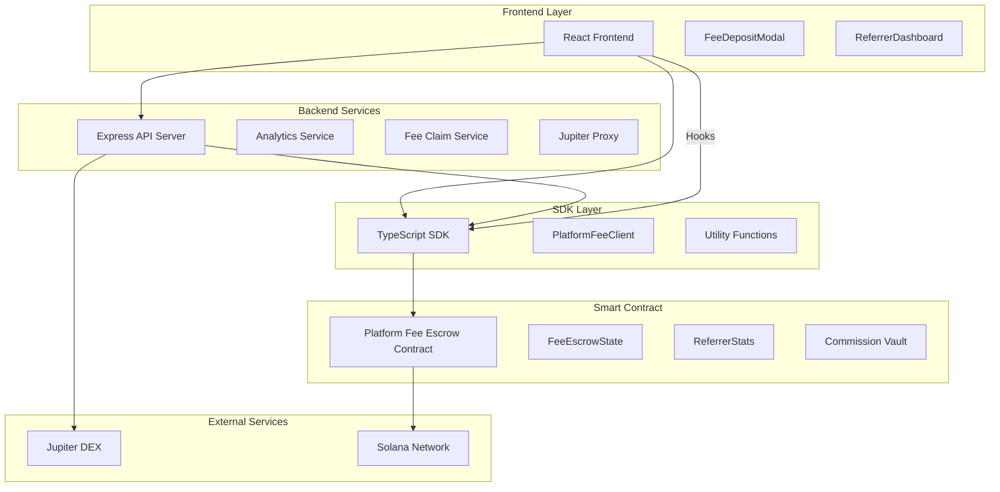
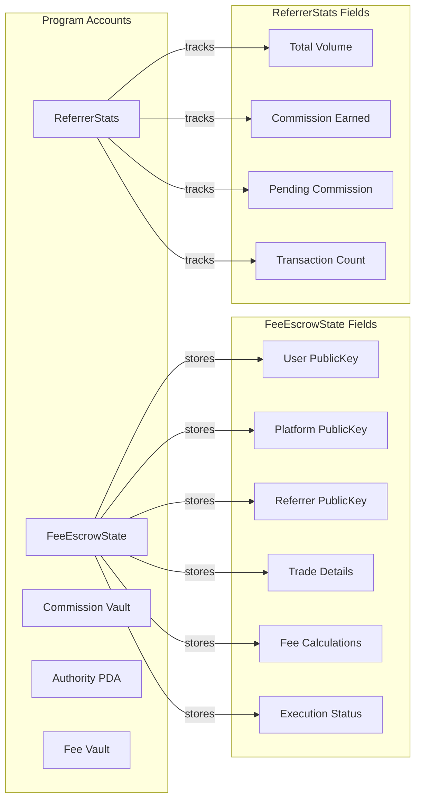

# System Architecture

This document provides detailed architectural diagrams for the Jupiter Ultra Enhanced Referral System.

## System Components Overview

## Account Structure

## Component Interactions

### Frontend Layer
- **React Frontend**: Main user interface
- **FeeDepositModal**: Modal for depositing platform fees
- **ReferrerDashboard**: Analytics dashboard for referrers

### Backend Services
- **Express API Server**: RESTful API endpoints
- **Analytics Service**: Handles referrer statistics and metrics
- **Fee Claim Service**: Manages fee claiming process
- **Jupiter Proxy**: Proxies requests to Jupiter DEX

### SDK Layer
- **TypeScript SDK**: Client library for system integration
- **PlatformFeeClient**: Main client class for contract interaction
- **Utility Functions**: Helper functions for PDAs, parsing, etc.

### Smart Contract
- **Platform Fee Escrow Contract**: Core Solana program
- **FeeEscrowState**: Per-user escrow state accounts
- **ReferrerStats**: Referrer performance tracking
- **Commission Vault**: Global commission storage