# Backend Services Interaction Flowchart

```mermaid
flowchart TD
    %% External Systems
    subgraph EXT["External Systems"]
        direction TB
        CLIENT["Client Applications<br/>Frontend & Mobile"]
        JUPITER["Jupiter API<br/>DEX Aggregator"]
        SOLANA["Solana RPC<br/>Blockchain Access"]
    end
    
    %% Application Layer
    subgraph APP["Application Layer"]
        direction TB
        SERVER["Express Server<br/>Main Application"]
        
        subgraph ROUTES["API Routes"]
            API_JUP["/api/jupiter/*"]
            API_FEE["/api/fees/*"]
            API_ESCROW["/api/escrow/*"]
            API_REF["/api/referrer/*"]
            API_ANALYTICS["/api/analytics/*"]
            API_ADMIN["/api/admin/*"]
        end
    end
    
    %% Core Services
    subgraph SERVICES["Core Services"]
        direction TB
        
        subgraph JUP_SERVICE["Jupiter Proxy Service"]
            JUP_HEALTH["Health Monitoring"]
            JUP_CACHE["Response Caching"]
            JUP_RETRY["Retry Logic"]
            JUP_MOCK["Mock Responses"]
        end
        
        subgraph FEE_SERVICE["Fee Claim Service"]
            FEE_POLL["Polling Loop"]
            FEE_BATCH["Batch Processing"]
            FEE_RETRY["Retry Logic"]
            FEE_METRICS["Claim Metrics"]
        end
        
        subgraph ANALYTICS_SERVICE["Analytics Service"]
            ANALYTICS_CACHE["Data Cache"]
            ANALYTICS_PROCESS["Data Processing"]
            ANALYTICS_EXPORT["Export Functions"]
            ANALYTICS_TRACK["Referrer Tracking"]
        end
    end
    
    %% Shared Infrastructure
    subgraph INFRASTRUCTURE["Shared Infrastructure"]
        direction TB
        SDK["Platform Fee SDK<br/>Blockchain Interface"]
        CACHE["Cache Layer<br/>Redis"]
        DB["Database<br/>PostgreSQL"]
        METRICS["Metrics & Monitoring<br/>Prometheus"]
    end
    
    %% Startup Process
    subgraph STARTUP["Application Startup"]
        direction TB
        INIT["Initialize Services"]
        HEALTH_CHECK["Health Checks"]
        START_TASKS["Start Background Tasks"]
        REGISTER_ROUTES["Register API Routes"]
    end
    
    %% Error Handling
    subgraph ERROR_HANDLING["Error Management"]
        direction TB
        ERROR_LOG["Error Logging"]
        CIRCUIT_BREAKER["Circuit Breaker"]
        FALLBACK["Fallback Responses"]
        RETRY_LOGIC["Retry Mechanisms"]
    end
    
    %% Shutdown Process
    subgraph SHUTDOWN["Graceful Shutdown"]
        direction TB
        STOP_TASKS["Stop Background Tasks"]
        DRAIN_CONN["Drain Connections"]
        CLOSE_SERVICES["Close Services"]
        CLEANUP["Cleanup Resources"]
    end
    
    %% Main Request Flow
    CLIENT --> SERVER
    SERVER --> ROUTES
    
    %% Jupiter Proxy Flow
    API_JUP --> JUP_SERVICE
    JUP_SERVICE --> JUPITER
    JUP_CACHE --> CACHE
    
    %% Fee Management Flow
    API_FEE --> SDK
    API_ESCROW --> SDK
    SDK --> SOLANA
    
    %% Analytics Flow
    API_REF --> ANALYTICS_SERVICE
    API_ANALYTICS --> ANALYTICS_SERVICE
    ANALYTICS_CACHE --> CACHE
    ANALYTICS_PROCESS --> DB
    
    %% Background Processing
    FEE_SERVICE --> SDK
    FEE_METRICS --> METRICS
    
    %% Inter-service Communication
    FEE_SERVICE -.-> ANALYTICS_SERVICE
    JUP_SERVICE -.-> ANALYTICS_SERVICE
    
    %% Error Handling Connections
    JUP_SERVICE --> ERROR_HANDLING
    FEE_SERVICE --> ERROR_HANDLING
    ANALYTICS_SERVICE --> ERROR_HANDLING
    
    %% Startup Flow
    INIT --> HEALTH_CHECK
    HEALTH_CHECK --> START_TASKS
    START_TASKS --> REGISTER_ROUTES
    
    %% Shutdown Flow
    SERVER -.-> STOP_TASKS
    STOP_TASKS --> DRAIN_CONN
    DRAIN_CONN --> CLOSE_SERVICES
    CLOSE_SERVICES --> CLEANUP
    
    %% Monitoring
    SERVICES --> METRICS
    METRICS --> HEALTH_CHECK
    
    %% Styling
    classDef external fill:#e8eaf6,stroke:#3f51b5,stroke-width:2px
    classDef application fill:#e8f5e8,stroke:#4caf50,stroke-width:2px
    classDef service fill:#fff3e0,stroke:#ff9800,stroke-width:2px
    classDef infrastructure fill:#e3f2fd,stroke:#2196f3,stroke-width:2px
    classDef process fill:#f3e5f5,stroke:#9c27b0,stroke-width:2px
    classDef error fill:#ffebee,stroke:#f44336,stroke-width:2px
    
    class EXT,CLIENT,JUPITER,SOLANA external
    class APP,SERVER,ROUTES,API_JUP,API_FEE,API_ESCROW,API_REF,API_ANALYTICS,API_ADMIN application
    class SERVICES,JUP_SERVICE,FEE_SERVICE,ANALYTICS_SERVICE service
    class INFRASTRUCTURE,SDK,CACHE,DB,METRICS infrastructure
    class STARTUP,SHUTDOWN,INIT,HEALTH_CHECK,START_TASKS,REGISTER_ROUTES,STOP_TASKS,DRAIN_CONN,CLOSE_SERVICES,CLEANUP process
    class ERROR_HANDLING,ERROR_LOG,CIRCUIT_BREAKER,FALLBACK,RETRY_LOGIC error
```



## Service Interaction Details

### Startup Sequence
1. **Initialize Services**: Create service instances with configuration
2. **Health Checks**: Verify external dependencies (Jupiter API, Solana RPC)
3. **Start Background Tasks**: Launch FeeClaimService polling loop
4. **Register API Routes**: Mount all endpoint handlers

### Request Handling Patterns

#### Jupiter Proxy Requests
```
Client → /api/jupiter/* → JupiterProxyService
├── Check Health Status
├── Check Cache for Response
├── Forward to Jupiter API (with retry)
├── Generate Mock Response (if needed)
└── Return Response to Client
```

#### Fee Operations
```
Client → /api/fees/* → SDK → Solana RPC
├── Calculate Fees
├── Validate Parameters
├── Build Transactions
└── Return Instructions
```

#### Analytics Requests
```
Client → /api/analytics/* → AnalyticsService
├── Check Cache
├── Process Data from DB
├── Generate Reports
└── Cache and Return Results
```

### Background Processing
- **FeeClaimService**: Continuously polls for claimable escrows
- **Concurrent Processing**: Handles multiple claims in batches
- **Retry Logic**: Failed claims are retried with exponential backoff
- **Metrics Collection**: Tracks success rates and performance

### Inter-Service Communication
- **Event-Driven**: Services emit events for cross-service coordination
- **Shared Cache**: Common caching layer for performance optimization
- **Metrics Hub**: Centralized monitoring and health reporting
- **SDK Integration**: All services use common SDK for blockchain operations

### Error Handling Strategy
- **Circuit Breaker**: Prevents cascade failures for external API calls
- **Retry Logic**: Configurable retry policies for transient failures
- **Fallback Responses**: Mock/cached responses when external services fail
- **Graceful Degradation**: Core functionality maintained during partial outages

### Monitoring and Observability
- **Health Endpoints**: Service-specific health checks
- **Performance Metrics**: Response times, throughput, error rates
- **Business Metrics**: Claim success rates, referrer performance
- **Logging**: Structured logging with correlation IDs