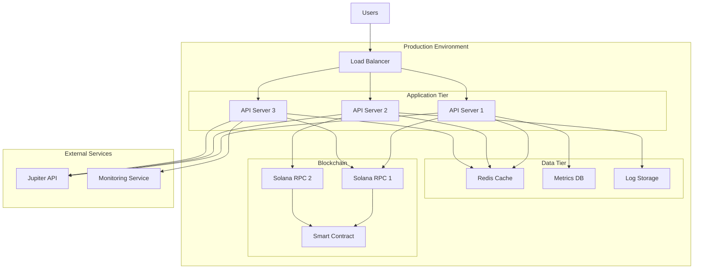
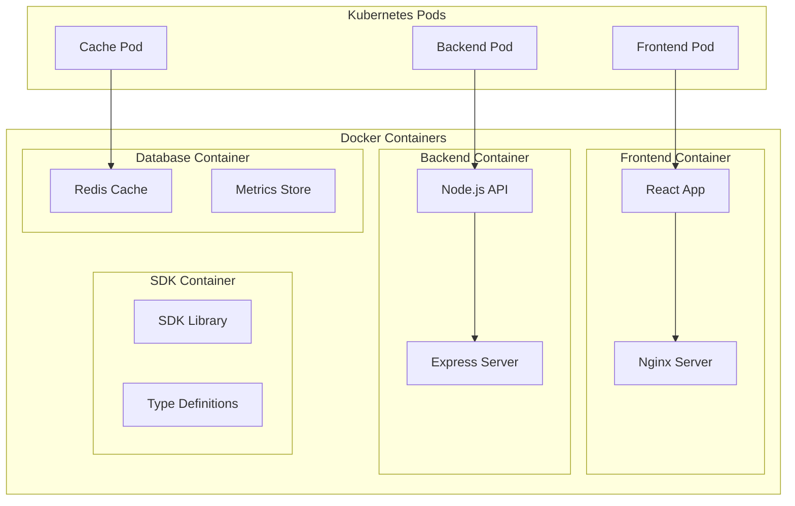
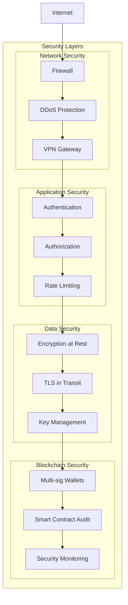
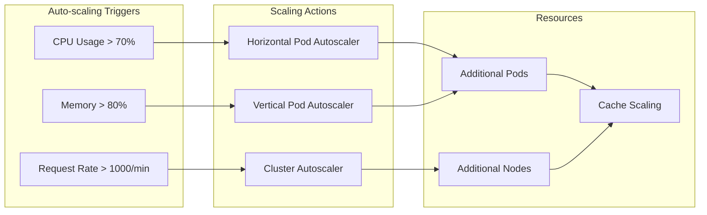
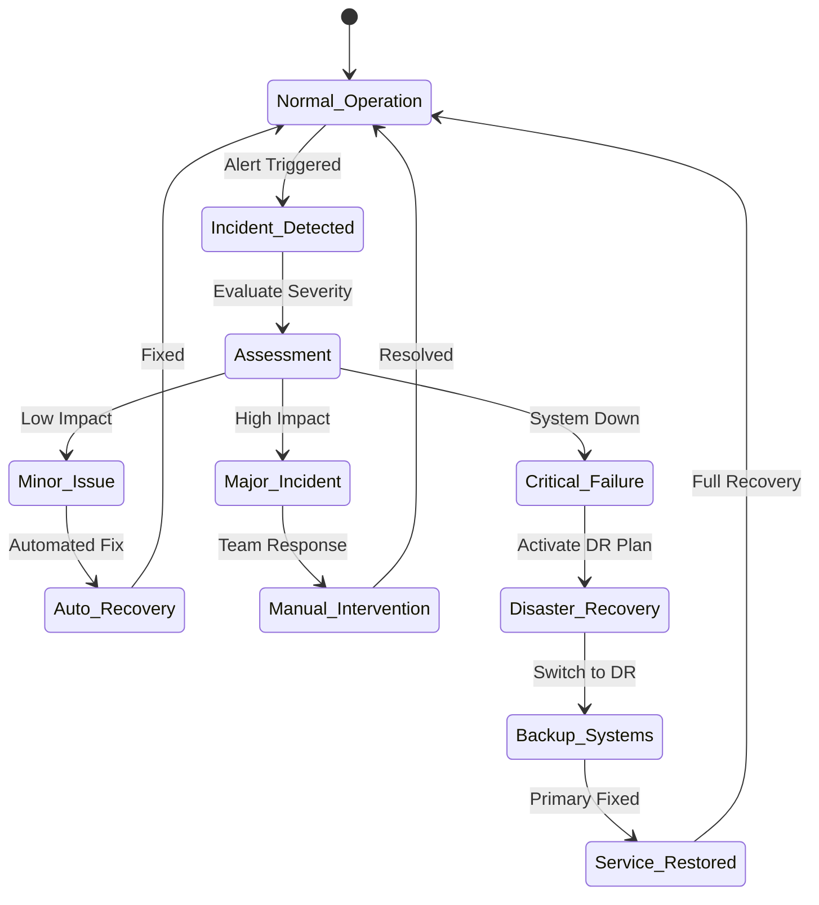

# Deployment Architecture

This document outlines the deployment architecture and infrastructure setup for the Jupiter Ultra Enhanced Referral System.

## Infrastructure Overview

## Deployment Pipeline

```mermaid
flowchart LR
    subgraph "Development"
        DEV[Local Development]
        TEST[Unit Tests]
        LINT[Code Linting]
    end
    
    subgraph "CI/CD Pipeline"
        BUILD[Build & Package]
        INTEGRATION[Integration Tests]
        SECURITY[Security Scan]
        DEPLOY_STAGING[Deploy to Staging]
    end
    
    subgraph "Staging Environment"
        STAGE_API[Staging API]
        STAGE_CONTRACT[Staging Contract]
        E2E[End-to-End Tests]
    end
    
    subgraph "Production"
        PROD_DEPLOY[Production Deploy]
        HEALTH[Health Checks]
        MONITOR[Monitoring]
    end
    
    DEV --> TEST
    TEST --> LINT
    LINT --> BUILD
    
    BUILD --> INTEGRATION
    INTEGRATION --> SECURITY
    SECURITY --> DEPLOY_STAGING
    
    DEPLOY_STAGING --> STAGE_API
    DEPLOY_STAGING --> STAGE_CONTRACT
    STAGE_API --> E2E
    E2E --> PROD_DEPLOY
    
    PROD_DEPLOY --> HEALTH
    HEALTH --> MONITOR
```

## Container Architecture

## Security Architecture

## Scaling Strategy

## Disaster Recovery

