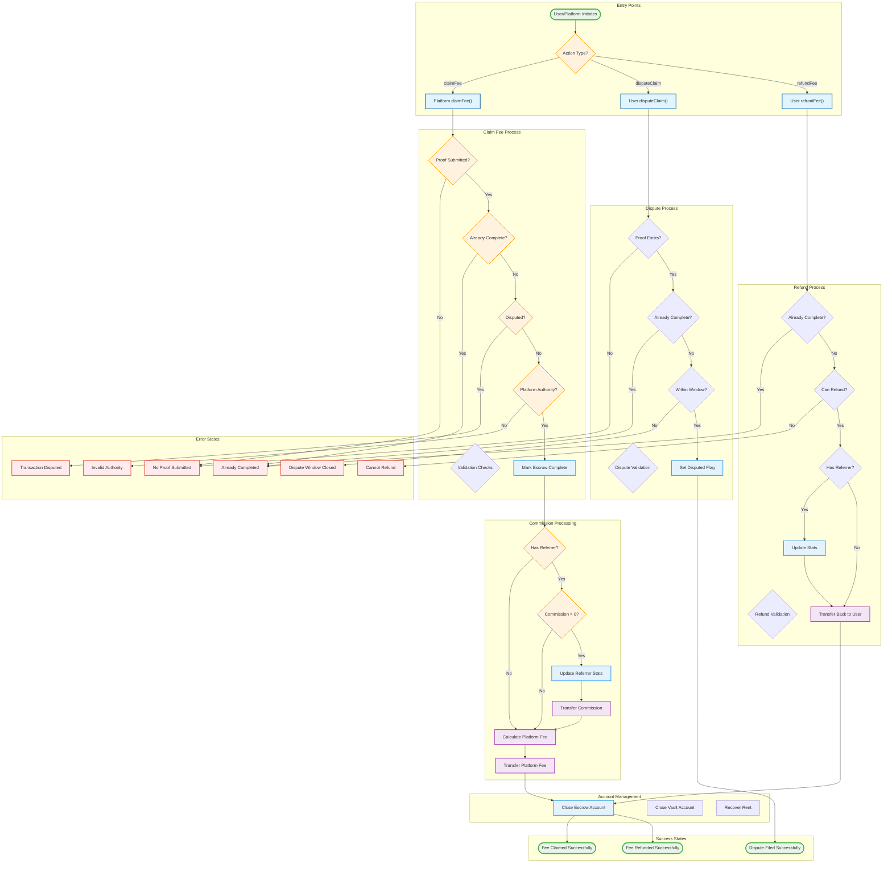

# Fee Claiming Process Flowchart

This Mermaid flowchart visualizes the complete fee claiming process including validation, commission distribution, and alternative flows for disputes and refunds.



## Process Details

### Key Validation Steps in claimFee()
1. **Proof Validation**: `escrow.proofSubmitted == true`
2. **Completion Check**: `!escrow.isCompleted`
3. **Dispute Check**: `!escrow.isDisputed`
4. **Platform Authority**: Verified through account derivation and signatures

### Commission Distribution Logic
- **Self-referral**: If `escrow.referrer == escrow.user`, no commission transfer occurs
- **Valid referrer**: Commission moves from vault to commission vault
- **Referrer stats updated**: 
  - `pendingVolume` → `confirmedVolume`
  - `totalCommissionEarned` increases
  - `pendingCommission` increases for later claiming

### Revenue Calculation
```
platformRevenue = actualFeeCharged - referrerCommission
```

### Alternative Flows

#### Dispute Window
- Users have **1,000 slots** after proof submission to dispute
- Must be called before escrow completion
- Sets `isDisputed = true`, blocking further claims

#### Refund Conditions
Fee can be refunded if:
- `currentSlot > expirationSlot` (expired)
- `escrow.isDisputed == true` (disputed)
- `!escrow.proofSubmitted` (no proof submitted)

### Account Closures
- **Successful claim**: Escrow and vault closed, rent goes to platform
- **Refund**: Escrow and vault closed, rent goes to user
- All account closures happen atomically within the instruction