# Platform Fee Escrow - depositFeeWithQuote() Flowchart

This Mermaid flowchart shows the complete flow of the `depositFeeWithQuote()` instruction, including all decision points, account creations, fee calculations, and error conditions.

```mermaid
flowchart TD
    %% Initialization Phase
    subgraph INIT["Initialization"]
        START([User Initiates Deposit])
        QUOTE[Get Jupiter Quote]
        VALIDATE{Validate Parameters}
    end
    
    %% PDA Derivation Phase
    subgraph PDA["PDA Derivation"]
        direction TB
        DERIVE_USER["User ATA<br/>Seeds: feeToken, user"]
        DERIVE_AUTH["Auth PDA<br/>Seeds: auth"]
        DERIVE_ESCROW["Escrow PDA<br/>Seeds: fee_escrow, user, seed"]
        DERIVE_VAULT["Vault PDA<br/>Seeds: vault, escrow, token, auth"]
        DERIVE_REF["Referrer Stats PDA<br/>Seeds: referrer_stats, referrer"]
    end
    
    %% Account Validation
    subgraph VALIDATION["Account Validation"]
        direction TB
        CHECK_ESCROW{Escrow Exists?}
        CHECK_REFERRER{Referrer Stats Exists?}
        CHECK_BALANCE{Sufficient Balance?}
    end
    
    %% Fee Calculation
    subgraph CALC["Fee Calculation"]
        direction TB
        BASE_FEE["Base Fee: 1%<br/>(10,000 basis points)"]
        GROSS_FEE["Gross Fee =<br/>tradeAmount × 10,000 ÷ 1,000,000"]
        REF_COMMISSION["Referrer Commission =<br/>grossFee × referrerShare"]
        USER_DISCOUNT["User Discount =<br/>grossFee × discountPercent"]
        ACTUAL_FEE["Actual Fee =<br/>grossFee - userDiscount"]
    end
    
    %% Account Setup
    subgraph SETUP["Account Setup"]
        direction TB
        INIT_ESCROW[Initialize Escrow Account]
        INIT_VAULT[Initialize Vault Account]
        INIT_REF_STATS[Initialize Referrer Stats]
        UPDATE_REF_STATS[Update Referrer Stats]
    end
    
    %% State Management
    subgraph STATE["State Management"]
        direction TB
        SET_ESCROW["Set Escrow Fields:<br/>• Quote Details<br/>• Fee Amounts<br/>• Timestamps"]
        SET_FLAGS["Set Status Flags:<br/>• isCompleted = false<br/>• isDisputed = false<br/>• proofSubmitted = false"]
        UPDATE_PENDING["Update Pending Stats:<br/>• pendingVolume += amount<br/>• totalTransactions += 1"]
    end
    
    %% Transfer Phase
    subgraph TRANSFER["Fee Transfer"]
        direction TB
        TOKEN_TRANSFER["Transfer Fee<br/>userATA → vault"]
        TRANSFER_CHECK{Transfer Success?}
    end
    
    %% Error Handling
    subgraph ERRORS["Error States"]
        direction TB
        ERR_PARAMS["Invalid Parameters"]
        ERR_EXISTS["Escrow Already Exists"]
        ERR_BALANCE["Insufficient Balance"]
        ERR_TRANSFER["Transfer Failed"]
    end
    
    %% Success State
    SUCCESS(["Deposit Complete<br/>Ready for Trade"])
    
    %% Main Flow
    START --> QUOTE
    QUOTE --> VALIDATE
    VALIDATE -->|Valid| PDA
    VALIDATE -->|Invalid| ERR_PARAMS
    
    DERIVE_USER --> DERIVE_AUTH
    DERIVE_AUTH --> DERIVE_ESCROW
    DERIVE_ESCROW --> DERIVE_VAULT
    DERIVE_VAULT --> DERIVE_REF
    
    DERIVE_REF --> CHECK_ESCROW
    CHECK_ESCROW -->|Exists| ERR_EXISTS
    CHECK_ESCROW -->|New| CHECK_REFERRER
    
    CHECK_REFERRER -->|Exists| CHECK_BALANCE
    CHECK_REFERRER -->|New| CALC
    
    CHECK_BALANCE -->|Insufficient| ERR_BALANCE
    CHECK_BALANCE -->|Sufficient| CALC
    
    BASE_FEE --> GROSS_FEE
    GROSS_FEE --> REF_COMMISSION
    REF_COMMISSION --> USER_DISCOUNT
    USER_DISCOUNT --> ACTUAL_FEE
    
    ACTUAL_FEE --> SETUP
    INIT_ESCROW --> INIT_VAULT
    INIT_VAULT --> INIT_REF_STATS
    INIT_REF_STATS --> STATE
    
    SET_ESCROW --> SET_FLAGS
    SET_FLAGS --> UPDATE_PENDING
    UPDATE_PENDING --> TRANSFER
    
    TOKEN_TRANSFER --> TRANSFER_CHECK
    TRANSFER_CHECK -->|Success| SUCCESS
    TRANSFER_CHECK -->|Failed| ERR_TRANSFER
    
    %% Styling
    classDef startEnd fill:#e8f5e8,stroke:#4caf50,stroke-width:3px
    classDef process fill:#e3f2fd,stroke:#2196f3,stroke-width:2px
    classDef decision fill:#fff3e0,stroke:#ff9800,stroke-width:2px
    classDef error fill:#ffebee,stroke:#f44336,stroke-width:2px
    classDef calculation fill:#f3e5f5,stroke:#9c27b0,stroke-width:2px
    
    class START,SUCCESS startEnd
    class QUOTE,INIT_ESCROW,INIT_VAULT,INIT_REF_STATS,SET_ESCROW,TOKEN_TRANSFER process
    class VALIDATE,CHECK_ESCROW,CHECK_REFERRER,CHECK_BALANCE,TRANSFER_CHECK decision
    class ERR_PARAMS,ERR_EXISTS,ERR_BALANCE,ERR_TRANSFER error
    class BASE_FEE,GROSS_FEE,REF_COMMISSION,USER_DISCOUNT,ACTUAL_FEE calculation
```



## Key Process Details

### PDA Seed Structures
- **Escrow PDA**: `["fee_escrow", user.pubkey, u64_seed]`
- **Referrer Stats PDA**: `["referrer_stats", referrer.pubkey]`
- **Auth PDA**: `["auth"]`
- **Vault PDA**: `["vault", escrow.key, feeToken, auth.key]`

### Fee Calculation Logic
```
Platform Fee Rate: 1% = 10,000 basis points
Gross Platform Fee = (tradeAmount × 10,000) ÷ 1,000,000
Referrer Commission = (grossPlatformFee × referrerSharePercent) ÷ 1,000,000
User Discount = (grossPlatformFee × referredDiscountPercent) ÷ 1,000,000
Actual Fee Charged = grossPlatformFee - userDiscount
```

### Expiration Logic
- **Duration**: 10 minutes (1,500 slots at ~400ms per slot)
- **Purpose**: Prevents stale escrows from accumulating
- **Refund Condition**: Users can refund after expiration

### Critical Validation Points
1. **Input Parameters**: All required fields present and valid
2. **Account Uniqueness**: Escrow PDA must not already exist
3. **Token Balance**: User must have sufficient tokens for fee
4. **Transfer Success**: Fee transfer to vault must succeed

### Account Initialization Sequence
1. User ATA (Associated Token Account) - derived
2. Auth PDA - derived 
3. Escrow PDA - initialized with user as payer
4. Vault Token Account - initialized with user as payer
5. Referrer Stats PDA - initialized if needed with user as payer

### Error Conditions
- Invalid input parameters
- Escrow already exists for user + seed combination
- Insufficient user token balance
- Token transfer failure
- Account initialization failure