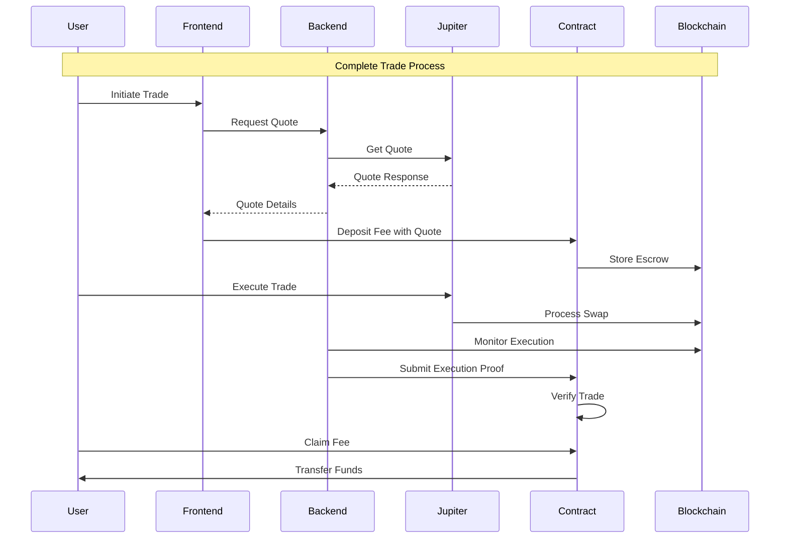
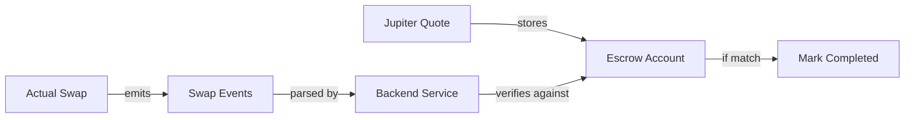
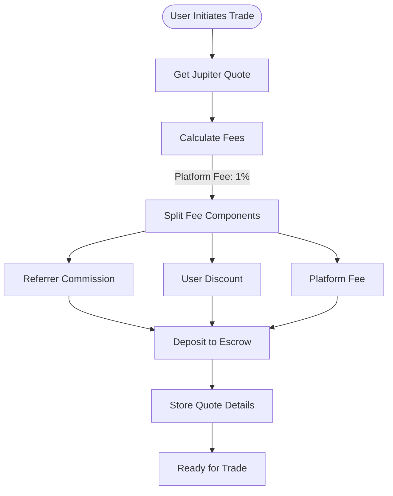
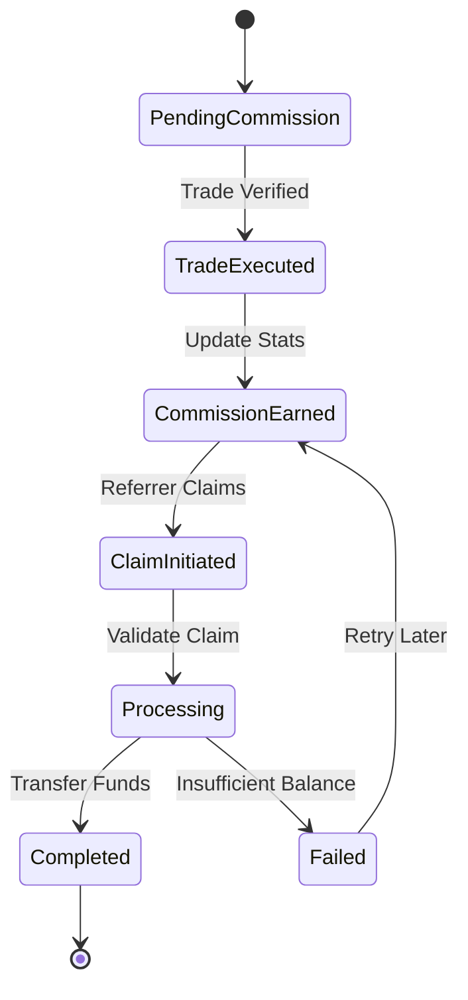
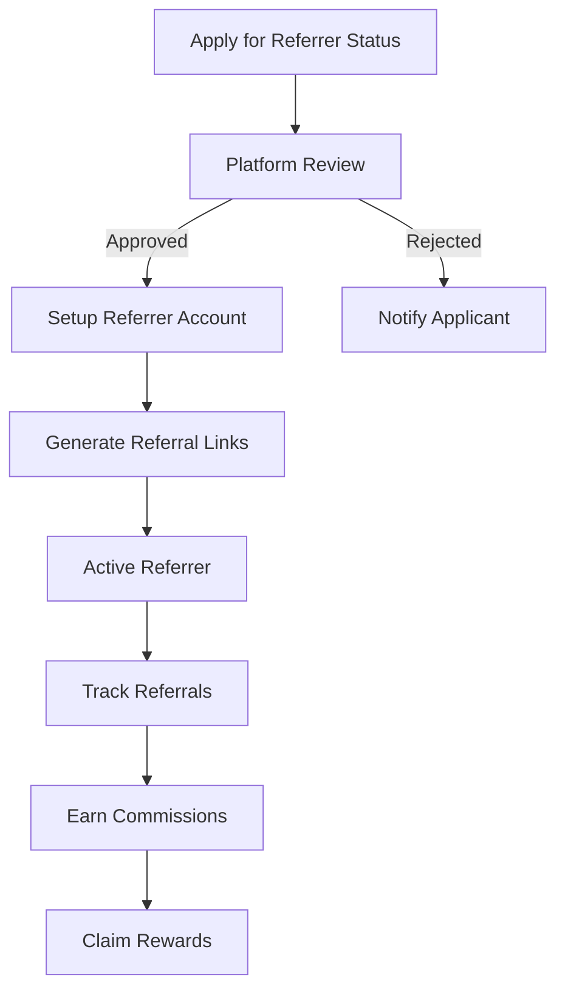
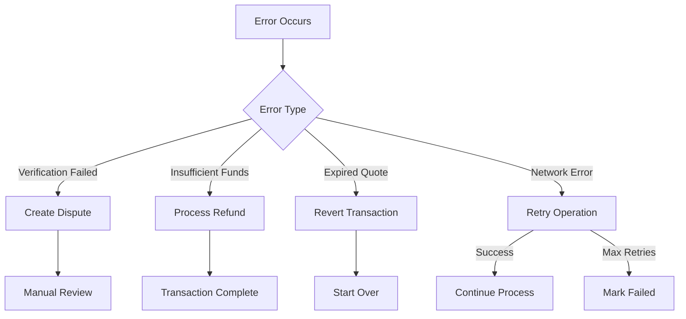

# System Flows

This document illustrates the key flows and processes in the Jupiter Ultra Enhanced Referral System.

## Trade Execution Flow

## Trade Verification Process

## Fee Deposit Flow

## Commission Claim Flow

## Referrer Onboarding Flow

## Error Handling Flow

