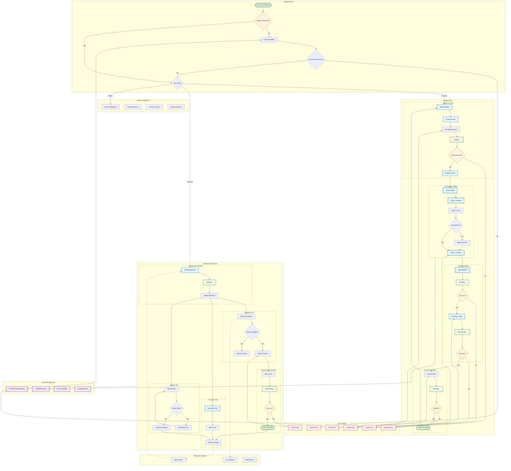

# Frontend User Journey Flowchart

## Key User Journey Highlights

### 1. Regular User Journey (Trading Flow)
- **Entry**: Wallet connection → Token selection → Amount input
- **Quote Phase**: Jupiter quote fetching with loading states and error handling
- **Fee Deposit**: Multi-step modal with referrer discount application
- **Execution**: Trade execution → Proof submission → Verification
- **Completion**: Success state with option for new trades

### 2. Referrer Journey
- **Dashboard Access**: Load comprehensive analytics dashboard
- **Link Management**: Generate and share referral links
- **Monitoring**: Real-time metrics with auto-refresh
- **Commission Claims**: Claim available commissions with transaction signing
- **Analytics**: Export data and view detailed history

### 3. Platform Admin Journey
- **Admin Dashboard**: Platform-wide metrics and analytics
- **Claims Processing**: Handle commission claims and disputes
- **System Monitoring**: Overall platform health and performance

### 4. State Management Integration
- **usePlatformFee Hook**: Manages complete trading flow state
- **useReferrerDashboard Hook**: Handles referrer analytics and claims
- **Error Handling**: Comprehensive error states with retry mechanisms
- **Loading States**: User feedback during async operations

### 5. Real-time Features
- **Auto-refresh**: Automatic dashboard updates
- **Live Metrics**: Real-time referrer performance data
- **Notifications**: User feedback for all state changes
- **Progress Tracking**: Multi-step flow progress indicators

This flowchart provides a complete visualization of the frontend user experience, showing all possible paths, error handling, state management, and component interactions within your Solana-based platform fee escrow system.