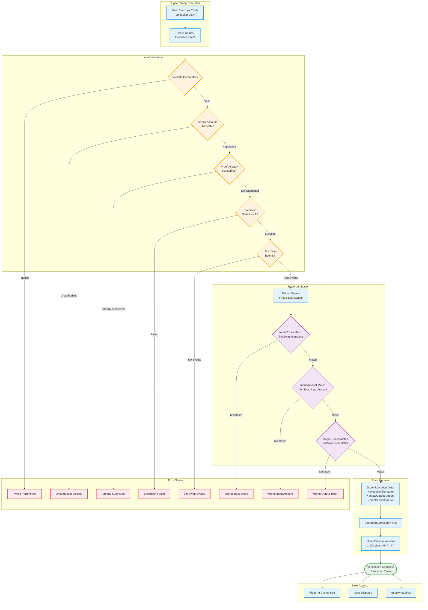

# Jupiter Trade Execution and Verification Process

## Comprehensive Mermaid Flowchart



## Detailed Verification Logic

### Three-Field Matching System

The smart contract uses a simplified verification approach that checks three critical fields:

1. **Input Token Match**: `firstSwap.inputMint == escrow.inputMint`
2. **Input Amount Match**: `firstSwap.inputAmount == escrow.inputAmount`
3. **Output Token Match**: `lastSwap.outputMint == escrow.outputMint`

This approach ensures that:
- The trade used the correct input token and amount as originally quoted
- The trade produced the expected output token type
- Multi-hop swaps are supported (first swap input, last swap output)

### State Updates After Successful Verification

```typescript
// Execution data storage
escrow.executionSignature = executionSignature;  // Audit trail
escrow.actualOutputAmount = lastSwap.outputAmount;  // Final output
escrow.proofSubmitted = true;  // Flag prevents double submission
escrow.proofSubmittedSlot = currentSlot;  // Timestamp for dispute window
```

### Dispute Window Mechanics

- **Duration**: 1,000 slots (approximately 6.7 minutes at 400ms per slot)
- **Purpose**: Allows users to dispute incorrect fee claims
- **Window Start**: Begins when `proofSubmittedSlot` is set
- **Access**: Only the original user can dispute during this window

### Error Conditions and Validations

| Check | Error Message | Description |
|-------|---------------|-------------|
| Proof Already Submitted | "Execution already submitted" | Prevents double submission attacks |
| Execution Failed | "Jupiter execution failed" | Only successful trades (status=1) are accepted |
| No Swap Events | "No swap events provided" | At least one swap event required |
| Wrong Input Token | "Wrong input token" | Input token must match escrow |
| Wrong Input Amount | "Wrong input amount" | Input amount must match exactly |
| Wrong Output Token | "Wrong output token" | Output token must match escrow |

### Key Design Decisions

1. **Simplified Verification**: No cryptographic proofs required - relies on basic field matching
2. **Multi-hop Support**: Uses first swap for input validation, last swap for output validation
3. **Execution Signature Storage**: Maintains audit trail for off-chain verification
4. **Dispute Window**: Provides safety mechanism against incorrect claims
5. **Single Submission**: Prevents replay attacks with `proofSubmitted` flag

### Integration with Broader System

This verification step is part of a larger fee escrow flow:

```
User Deposit → Jupiter Trade → Submit Execution → Dispute Window → Fee Claim/Refund
```

The verification ensures that fees are only released when legitimate trades matching the original quote parameters have been executed.