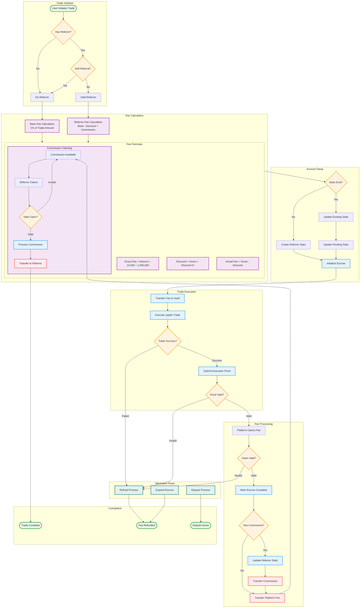

# Referral System & Commission Distribution Flowchart



## Key Process Flows

### 1. Fee Calculation Tiers
- **Default Fee**: 1% (10,000 basis points) - no referrer
- **Referred Fee**: Base 1% minus user discount (0-0.1%) with referrer commission (0-0.3%)
- **Self-Referral Prevention**: If referrer == user, treated as no referrer

### 2. Commission Distribution Formula
```
grossPlatformFee = tradeAmount × 10,000 ÷ 1,000,000
referrerCommission = grossPlatformFee × referrerSharePercent ÷ 1,000,000
userDiscount = grossPlatformFee × referredDiscountPercent ÷ 1,000,000
actualFeeCharged = grossPlatformFee - userDiscount
platformRevenue = actualFeeCharged - referrerCommission
```

### 3. State Transitions
- **Pending**: Stats updated during fee deposit
- **Confirmed**: Stats moved from pending to confirmed after successful claim
- **Commission Flow**: vault → commissionVault → referrerAta

### 4. Error Handling
- Expired transactions trigger refund path
- Failed verification allows user dispute
- Self-referral automatically bypasses referrer benefits
- Commission claims require positive pending balance

### 5. Key Security Features
- Time-based expiration and dispute windows
- Proof verification against Jupiter execution
- Atomic state transitions
- Self-referral prevention
- Commission vault isolation