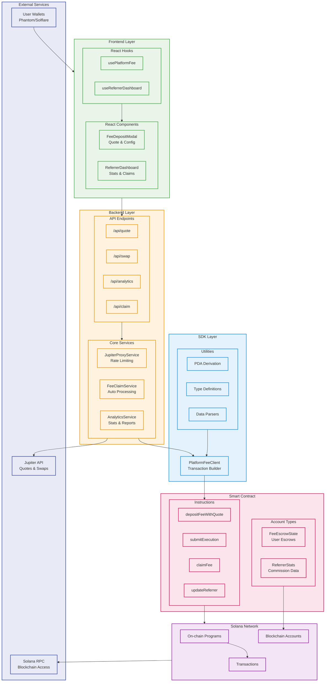
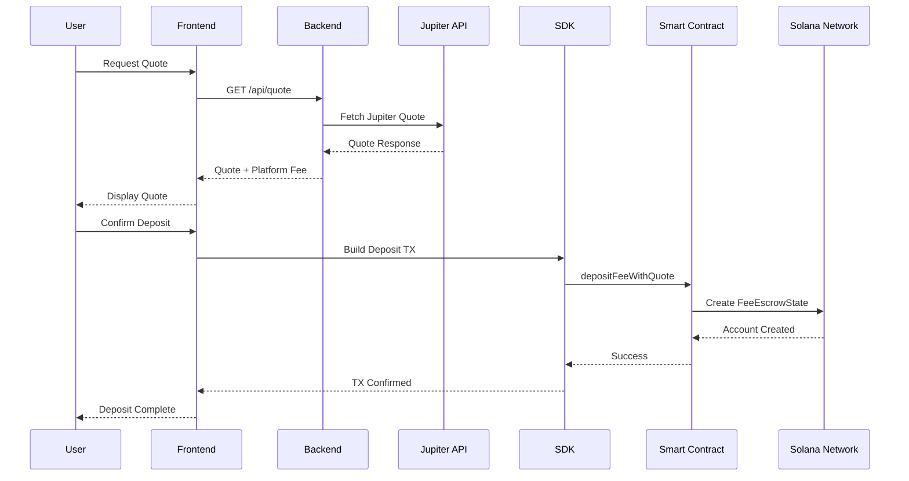
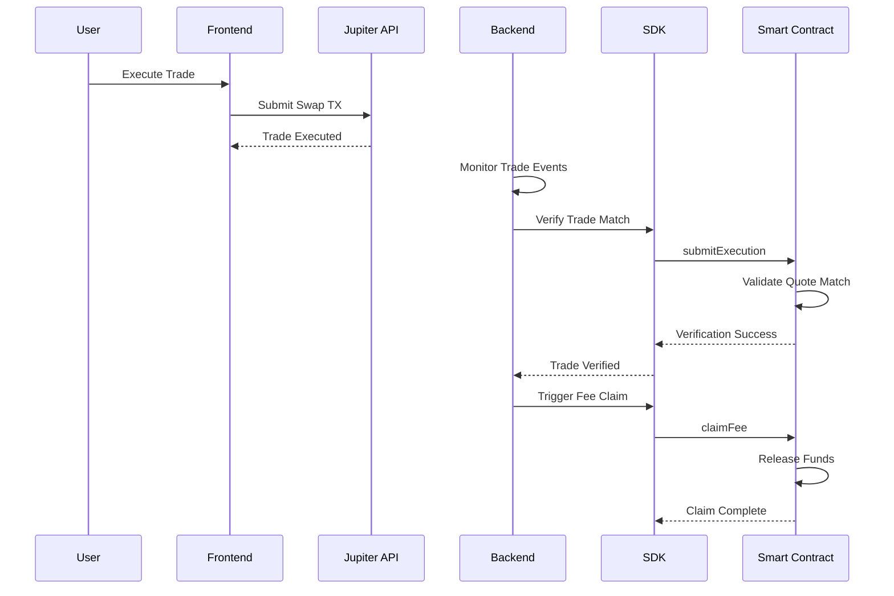
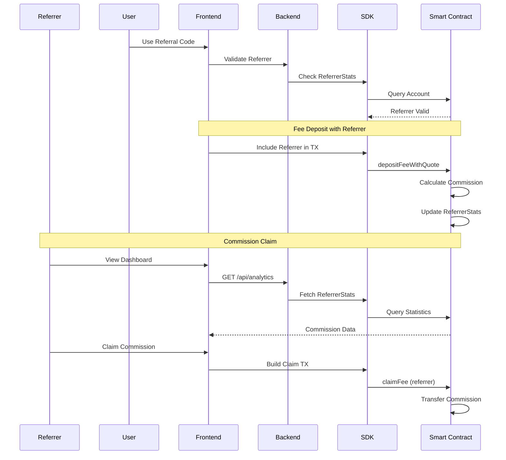

# System Architecture Overview

## Key Data Flows

### 1. Quote and Fee Deposit Flow

### 2. Trade Execution and Verification Flow

### 3. Referrer Commission Flow

## Architecture Highlights

### 🔑 Key Design Patterns
- **Escrow Pattern**: Funds held until trade verification
- **PDA Architecture**: Deterministic account addresses
- **Proxy Integration**: Backend mediates Jupiter API calls
- **Event-Driven**: Automated verification and processing

### 🛡️ Security Features
- **Quote Matching**: Verify inputMint + outputMint + inputAmount
- **Escrow Protection**: Funds locked until verification
- **Referrer Validation**: Prevent commission fraud
- **Rate Limiting**: Backend protects against abuse

### 📊 Monitoring Points
- **Trade Verification**: Real-time swap monitoring
- **Commission Tracking**: Referrer performance analytics
- **System Health**: RPC connectivity, Jupiter availability
- **User Experience**: Transaction success rates

### 🔄 Error Handling
- **Jupiter Downtime**: Fallback mechanisms
- **RPC Issues**: Multiple endpoint redundancy
- **Verification Failures**: Manual review process
- **Network Congestion**: Retry logic with backoff